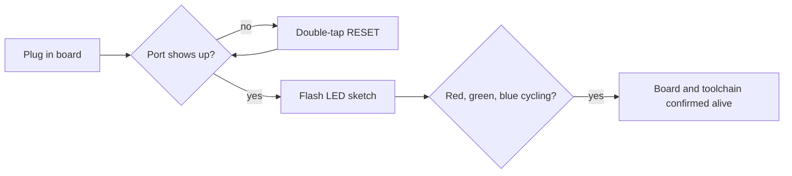

# 00 - LED Sanity Test

**Phase 0. Status: done.**

This is the first thing I ran on the board, before any sensor touched it. The goal was small on purpose: prove the Seeed XIAO nRF52840 Sense actually flashes and runs code. Nothing else matters if this doesn't work.

## What it actually runs

Cycles the onboard RGB LED red, green, blue, half a second each, forever. That's it. No I²C, no serial, no sensors.

## Why bother with something this trivial

If flashing fails, every later phase fails with it, and you won't know whether the bug is in your code or your toolchain. Isolating "is the board alive" from "is my sensor code correct" saves a lot of confused debugging later. This is the cheapest possible way to answer the first question.

## The one real problem I hit

The board wouldn't show up as a programmable COM port the first time I plugged it in. Turns out the nRF52840 needs a specific trick: double-tap the RESET button. That drops it into UF2 bootloader mode and it enumerates properly. After that, uploads worked normally. I hit this again more than once over the course of the project, so it's worth remembering. It's not a one-time fluke.

## Toolchain setup (Arduino IDE)

1. File → Preferences → Additional Boards Manager URLs, add:
   `https://files.seeedstudio.com/arduino/package_seeeduino_boards_index.json`
2. Tools → Board → Boards Manager, search "seeed nrf52", install it.
3. Tools → Board → Seeed XIAO nRF52840 Sense.
4. Tools → Port → the port that shows up as the XIAO (double-tap RESET first if it's not there).
5. Open `00_led_sanity_test.ino`, hit Upload.

## One gotcha in the code itself

The LED is active-LOW. `digitalWrite(LED_RED, LOW)` turns it on. Write `HIGH` expecting the light to come on, and you'll sit there for a minute wondering why nothing's happening. The board package defines `LED_RED`, `LED_GREEN`, `LED_BLUE` for you, so you don't need to know the raw pin numbers.

## What's here

- [`00_led_sanity_test.ino`](00_led_sanity_test.ino), the sketch.
- [`story.md`](story.md), the short version of how this session actually went.
