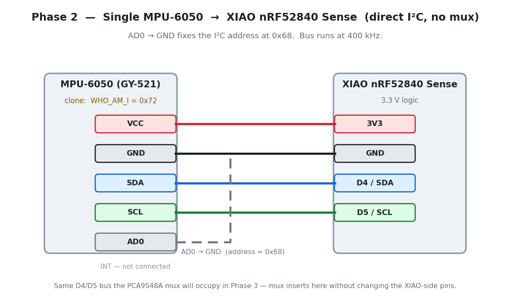
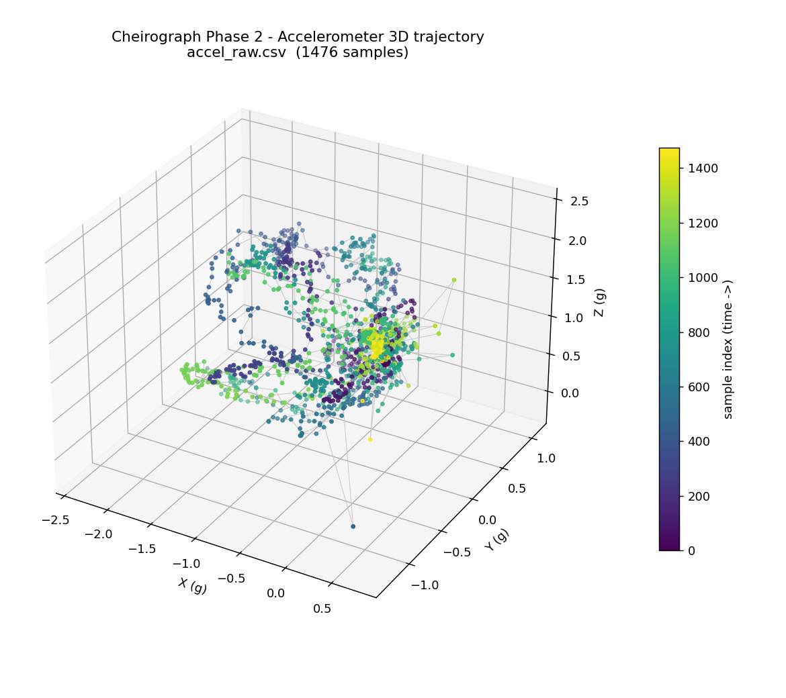
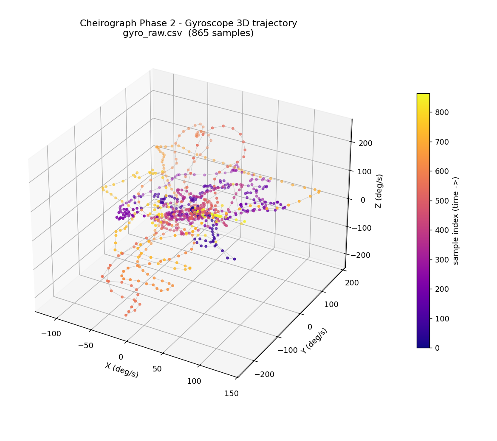

# 02 — Single MPU-6050 Test (Direct I²C)

**Phase 2. Status: done — sensor alive, raw accel + gyro verified and plotted. No mux yet.**

Before wiring five sensors behind a multiplexer, I wanted one working sensor I actually understood. Debugging one chip is a lot easier than debugging five behind a mux, so this stage is deliberately narrow: wire a single MPU-6050 straight to the XIAO, no mux, and get clean data out.

This is also where I ran into the first real problem of the project.

## Wiring

Four wires, plus one that fixes the address.

| MPU-6050 pin | XIAO pin | Purpose |
|---|---|---|
| VCC | 3V3 | Power |
| GND | GND | Ground |
| SDA | D4 / SDA | I²C data |
| SCL | D5 / SCL | I²C clock |
| AD0 | GND | Sets I²C address to `0x68` |
| INT | — | Unused here |

This is the same D4/D5 bus the mux sits on later. Proving one bare sensor here means that if a finger misbehaves once the mux is in, the sensor and driver are already known-good — so the mux becomes the first suspect, not the last.

## The clone chip

My first attempt used the Adafruit_MPU6050 library. It printed `Failed to find MPU6050 chip!` and stopped dead. I ran an I²C scanner and it clearly found something at `0x68`, so the wiring wasn't the problem. Then I read the `WHO_AM_I` register (0x75) directly instead of trusting the library's judgment, and it came back `0x72`.

A genuine MPU-6050 reports `0x68` there. `0x72` belongs to the MPU-6500/9250 family. What I had was a clone — a very common situation with cheap "MPU-6050" breakout boards — and Adafruit's library checks that register strictly and refuses anything that doesn't match exactly.

Switched to `MPU6050_light`, which doesn't gate on that check, and it worked immediately. Full reasoning behind the library swap is in the (private) decision log; the short version is that `MPU6050_light` is lenient about chip identity and still does proper bias calibration in one call. Since all five finger modules came from the same order, I assumed going in that they were likely all the same clone — worth scanning each one individually once they went on the glove, which I did later.

## What's in this folder

| File | What it prints | Role |
|---|---|---|
| [`02_single_mpu6050_test.ino`](02_single_mpu6050_test.ino) | `millis,sensor_id,aX,aY,aZ,gX,gY,gZ` | The real milestone sketch, full serial contract |
| [`diagnostics/i2c_scan/`](diagnostics/i2c_scan/i2c_scan.ino) | text | Scans the bus and reads `WHO_AM_I` — this is the sketch that found the clone |
| [`diagnostics/gyro_raw/`](diagnostics/gyro_raw/gyro_raw.ino) | `gX,gY,gZ` | Minimal gyro-only stream, used to build the gyro plot below |
| [`diagnostics/accel_raw/`](diagnostics/accel_raw/accel_raw.ino) | `aX,aY,aZ` | Minimal accel-only stream, used to build the accel plot below |

Arduino IDE only compiles one sketch per folder, which is why the diagnostics are split into their own subfolders instead of living side by side.

## What "done" looks like

- Sensor answers at `0x68`, streams cleanly, no I²C hangs or garbage values.
- Flat and still, accel reads roughly `0, 0, 1` g — gravity sitting on Z. Tilting moves the axes the way you'd expect.
- Gyro sits near 0 deg/s at rest (after calibration), swings out to a couple hundred deg/s on a fast twist, comes back down.
- Both captures saved and plotted in 3D below.

## The plots

Built with a small Python script (`plot_imu_3d.py`, in the project's `tools/`) from the two diagnostic captures. Each point is one sample; color goes from dark to bright over time, so you can read the order of motion, not just where the points ended up.

This is the real sanity check. Gravity has constant magnitude, so every point should sit roughly on a sphere of radius 1 g — and it does. The bright cluster is where I set the sensor down and let it sit still at the end. The couple of points past 2 g are real linear acceleration from a quick shake, not sensor noise.

The gyro path loops out during each twist and comes back toward zero once I stop moving — angular rate, not angle, so it's tracking speed of rotation, not position. It never quite returns to a perfect zero. That small leftover bias, a couple deg/s, is exactly the kind of drift the Madgwick filter has to fight later.

## What this isn't

No mux, no fusion, no other sensors. One sensor, proven honest.

## Proof

- CSV captures: [`accel_raw.csv`](accel_raw.csv), [`gyro_raw.csv`](gyro_raw.csv)
- [`data-notes.md`](data-notes.md) — original notes on how these captures were taken.
- [`story.md`](story.md) — the narrative version of this session.
