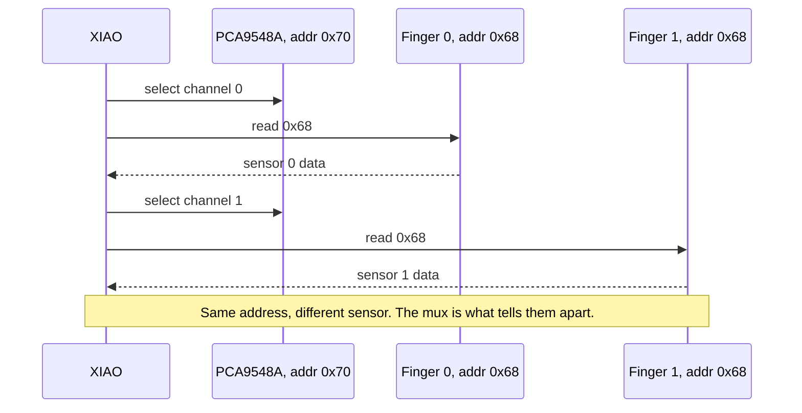

# 03 - I²C Multiplexer

**Phase 3. Status: done.**

Here's the core problem this stage solves: every MPU-6050 on the bus answers at the same I²C address, `0x68`. That's fine with one sensor. With five, you get an address collision, the bus can't tell them apart. The fix is a PCA9548A, an 8-channel I²C multiplexer. Write a channel-select byte to it (address `0x70`), and only that one channel is actually connected to the bus. Switch channels, and you're talking to a different sensor at the exact same address.

## How I knew the mux was solid

- Write a channel byte to `0x70`, then read `0x68`, and you get data back from the sensor on that specific channel.
- All five channels confirmed individually readable, no cross-talk between them.
- Switching channels doesn't hang the bus.

## The gotcha that actually matters here

You must select the mux channel before you address `0x68`. Write `0x00` to `0x70` and every channel is disabled, a safe idle state. But forget to select a channel first, and you end up reading from whichever channel was last active. That data looks completely plausible. It's just from the wrong finger. This is the kind of bug that doesn't announce itself, it just quietly gives you wrong readings that pass every sanity check.

## Why no dedicated sketch lives here

This stage never got its own standalone firmware. The Phase 4 sketch (all six IMUs) includes a boot-time channel scan that swept all eight mux channels and found `0x68` on exactly channels 0 through 4, nothing on 5 through 7, and no cross-talk. That satisfied every "done" criterion above without writing a separate test. If a channel ever misbehaves in isolation later, the scanning pattern from that sketch is the right starting point for a focused retest.

## Why this stage matters

Everything downstream depends on this switching loop working cleanly. If the mux is unreliable, nothing built on top of it can be trusted, not the raw reads, not the fusion, not the classifier. Better to prove it in isolation, with nothing else in the way, than to find out it's flaky three layers up the stack.

## What's here

- [`main.cpp`](main.cpp), the mux-handling code, reused directly by the Phase 4 sketch.
