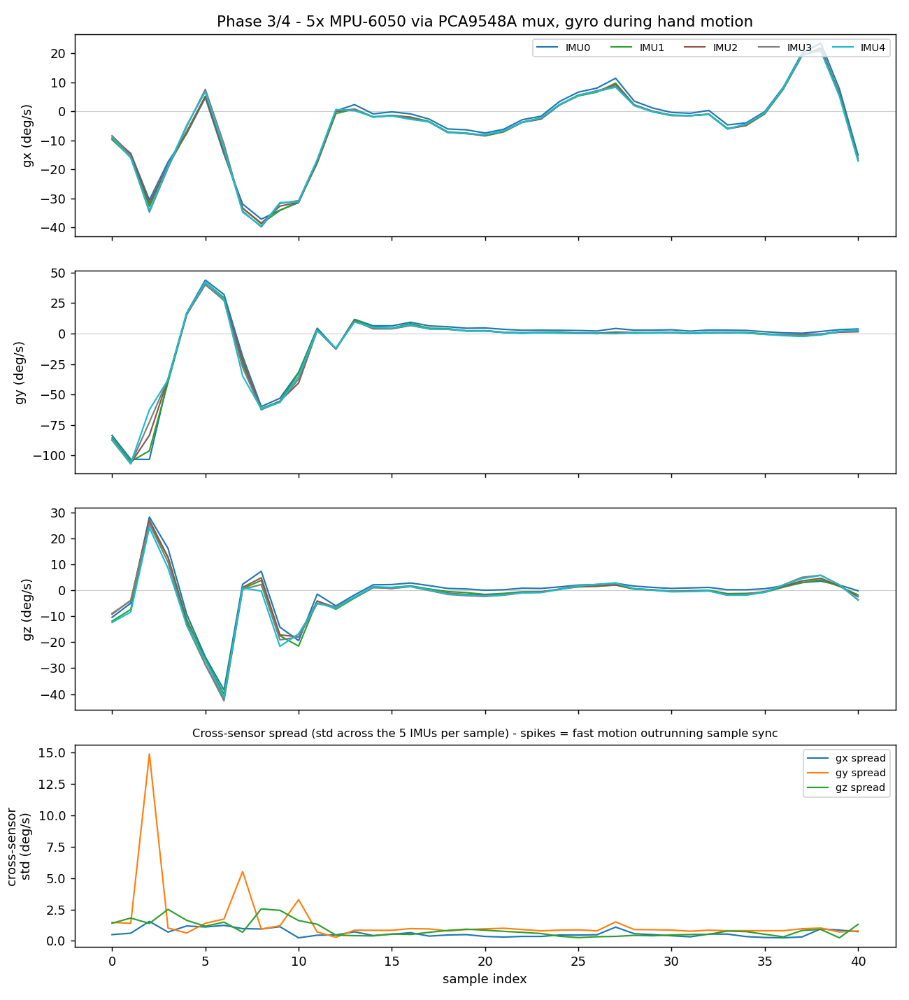
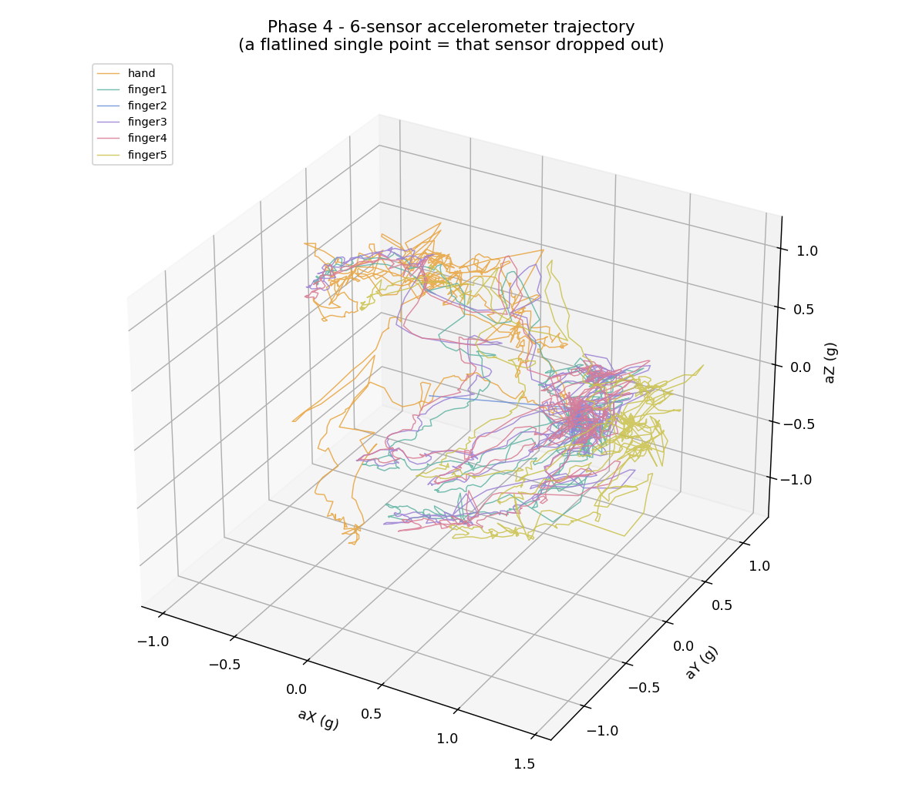
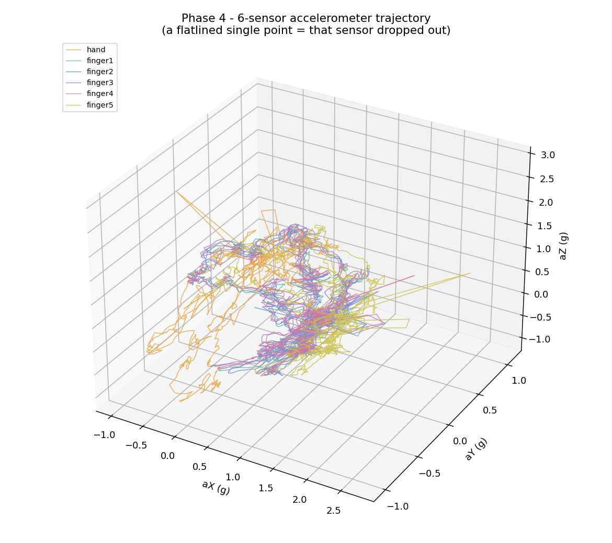

# 04 — All Six IMUs, Raw, at 100 Hz

**Phase 4. Status: near-complete.** All six sensors read correctly and the real serial contract is in place. Two open items remain — a rate shortfall and an intermittent contact issue — documented honestly below rather than glossed over, since they don't block moving forward but do need attention before I'd call this phase fully closed.

## The goal

Read all six IMUs — five MPU-6050s behind the mux, plus the XIAO's onboard chip as the hand reference — in one timed loop, targeting 100 Hz, and stream it all out as a stable CSV.

## Serial contract

```
millis,sensor_id,ax,ay,az,gx,gy,gz
```

One line per sensor per sample. `sensor_id`: 0 is the hand (onboard), 1 through 5 are the fingers (mux channels 0 through 4).

## What "done" looks like

- Loop period under 10 ms — that's 100 Hz — with no missed samples.
- All six sensor IDs showing up in the output.
- Live plotting confirms six distinct, sensible traces.

## Getting here in two passes

**First pass** (bench, all five fingers): wired the PCA9548A on a breadboard — see the photos below — and wrote a sketch that loops over all five finger sensors, one `MPU6050_light` object reused across mux channels since only one channel is ever electrically live at once. A boot-time channel scan confirmed `0x68` present on channels 0 through 4 with zero cross-talk. Captured a hand-motion test and checked it with a correlation script: all five sensors tracked the same physical rotation, with correlation against the first sensor ranging from 0.999 down to 0.975 — falling off slightly the further a sensor sat down the wiring chain, which lines up with small timing skew from reading them one after another rather than simultaneously, not a bad sensor. This pass was gyro-only and didn't yet include the hand IMU or the real serial contract — just proof the multi-sensor read itself was sound.

**Second pass** (the real Phase 4 sketch): added the onboard hand IMU into the same loop, added accelerometer alongside gyro, switched to a properly timed loop instead of a fixed delay, and added a 10-second still-calibration window at boot that logs a per-sensor gyro bias/noise table. Also added a periodic rate report so "100 Hz" would be a measured number, not an assumption.

## What the numbers actually showed

- All six sensors initialize and read on every boot — no dead channel at power-on.
- **Measured rate: about 93.6–93.7 Hz**, not the 100 Hz target. Six sequential mux-switch-and-read cycles cost more real time than the naive 10 ms budget assumes. Open item — the fix is almost certainly trimming per-tick serial output, since every `Serial.print` call blocks on UART.
- **The calibration window wasn't genuinely still.** Across every capture in this phase, the printed gyro bias/noise table showed 25 to 100+ deg/s of standard deviation — an order of magnitude above what a truly stationary sensor should read. This was a capture-discipline problem, not a firmware bug: the rig was being touched or settling during the "hold still" window. It resolved on its own in the next phase once I was more careful about it.
- **Finger 2 (mux channel 1) had two separate dropout incidents** across two sessions — once for the whole rest of a run, once for about 340 ms. A sensor going to a clean, unrecovering `0,0,0,0,0,0` is a specific and useful signal: a live MPU always carries roughly 1 g of gravity somewhere, so an exact zero means the chip's output registers are dead, not that the world briefly stopped having gravity. Two separate dropout windows on the same channel across two sessions points at a loose physical contact — a breadboard jumper, most likely — not a code fault.

## Two things worth remembering from this stage

**The onboard IMU isn't behind the mux — it's a separate device on the same bus.** The LSM6DS3 sits at a fixed address (`0x6A`) that doesn't collide with the mux or the finger sensors. But if you forget to deselect every mux channel before reading it, whichever finger channel was last selected stays electrically connected, and you silently read a finger's data while thinking you're reading the hand sensor. The fix is one line — write `0x00` to the mux to disable every channel first — but it's an easy trap to fall into.

**A sensor reading exactly `0.0000, 0.0000, 0.0000` for accel is not a "very still" reading — it's a dead one.** A live accelerometer always shows gravity somewhere in its three axes. Learning to read an exact-zero as "this chip's registers are frozen" rather than "the sensor is calm" saved a lot of confused debugging later, especially once the finger sensors turned out to have a much stranger version of this same failure mode.

## Proof

- Firmware: [`04_all_imus_raw.ino`](04_all_imus_raw.ino)
- Captures: [`movement_test.csv`](movement_test.csv) (five-finger gyro-only bench test), [`capture_01_raw.csv`](capture_01_raw.csv), [`capture_02_full_session.csv`](capture_02_full_session.csv), [`capture_03_full_session.csv`](capture_03_full_session.csv)
- Bench photos: [`breadboard_top.jpg`](breadboard_top.jpg), [`breadboard_angle.jpg`](breadboard_angle.jpg)



All five sensors tracking the same physical motion — the near-parallel lines are the point; a dead or cross-talking channel would show up here as an outlier or a flat line.





Static views of the six-sensor accelerometer trajectories; animated GIF versions ([`6imu_accel_3d.gif`](6imu_accel_3d.gif), [`6imu_accel_3d_capture03.gif`](6imu_accel_3d_capture03.gif)) show the same data as it evolves over time — useful for spotting a channel that freezes mid-run, which is exactly how the finger-2 dropout was first confirmed visually.

- Interactive visualizer: [`visualizer.html`](visualizer.html)
- Original capture notes: [`data-notes-phase3-4.md`](data-notes-phase3-4.md), [`data-notes-phase4.md`](data-notes-phase4.md)

## What this isn't

Not fused yet — this is raw accel and gyro only, no orientation math.
