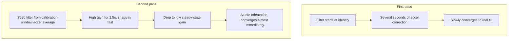
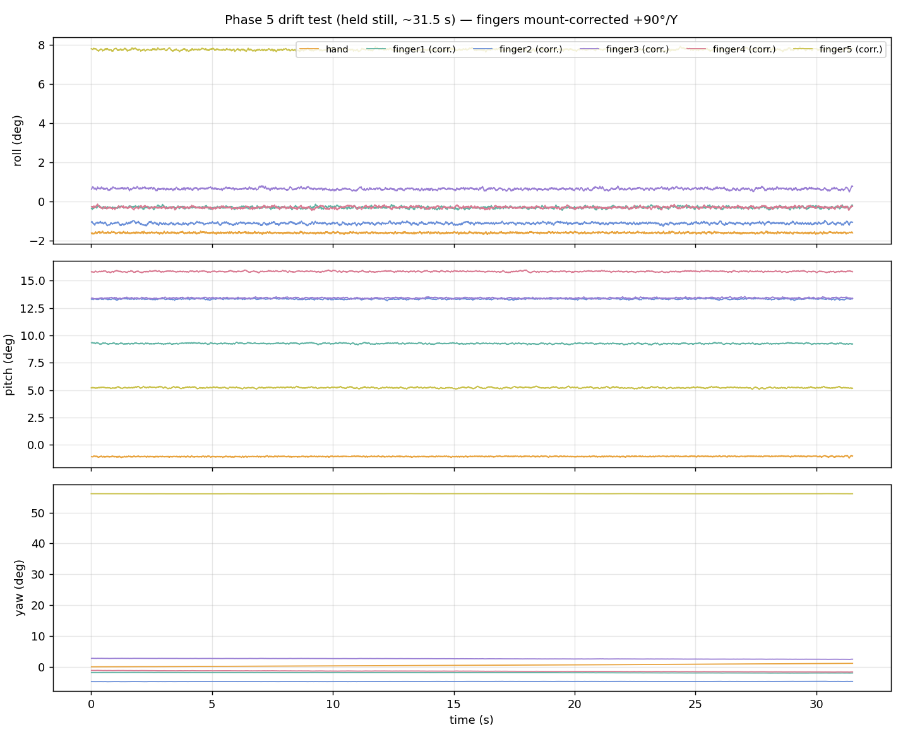
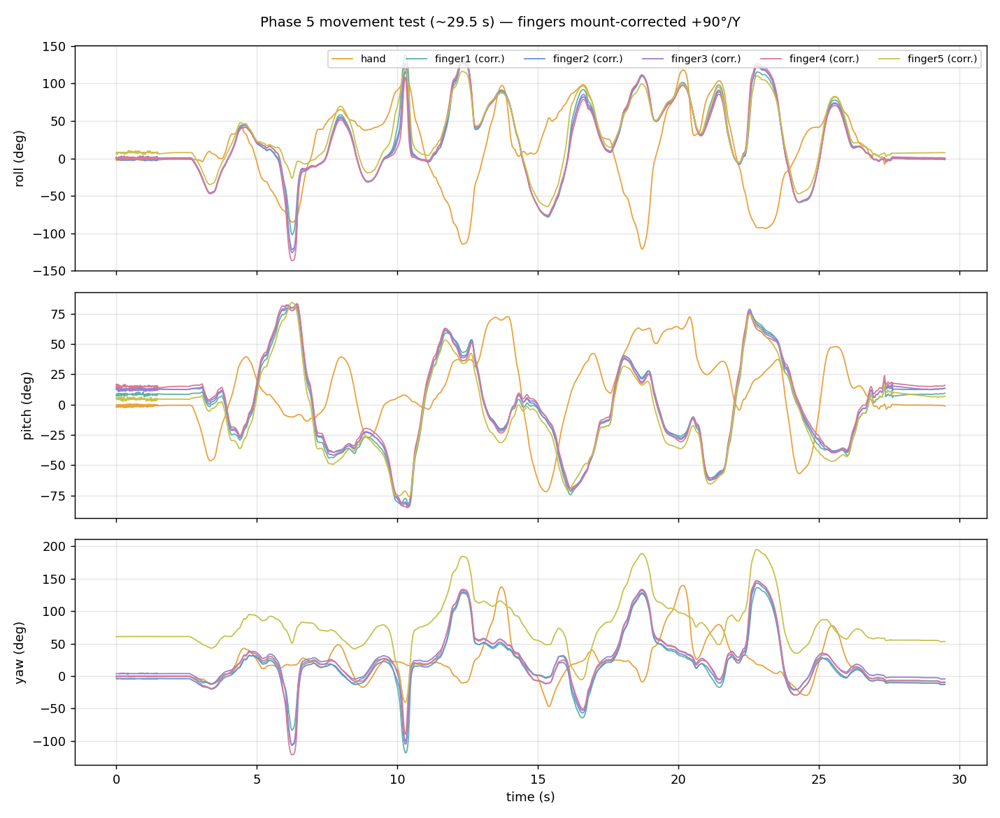

# 05 - Madgwick Fusion, Per IMU

**Phase 5. Status: bench-verified, second pass.**

This is where raw accel and gyro numbers turn into something usable: an orientation. Each of the six sensors gets its own Madgwick filter, a well-known algorithm that fuses accelerometer and gyroscope data into a quaternion representing that sensor's orientation in space.

## Serial contract

```
millis,sensor_id,qw,qx,qy,qz,roll_deg,pitch_deg,yaw_deg[,ax,ay,az,gx,gy,gz]
```

Roll, pitch, and yaw are derived from the quaternion purely for human-readable logging. The quaternion itself is the value the next stage actually consumes.

## Why Madgwick, and not Mahony or a simple complementary filter

Short version: Madgwick's gradient-descent correction converges faster from a bad initial guess and doesn't need a manually tuned integral gain the way Mahony does. It costs more per sample, but six filters running at 100 Hz still leaves the nRF52840 with headroom, so that cost doesn't actually bite here. Full reasoning is in the project's private decision log.

## What changed between the first and second pass

The first version started every filter at identity orientation and let it fight its way to the sensor's real resting tilt over several seconds of accel correction. That's slow and looks like drift if you don't know what's happening.



- **Seeds each filter directly from its own calibration-window accel reading**, instead of starting blind. Yaw stays at zero since it's not observable from accelerometer data alone, a physical limitation, not an oversight.
- **Uses a two-stage gain**: a high gain for about 1.5 seconds right after calibration, so the filter snaps into place fast if the seed was slightly off, then drops to a low steady-state gain so normal sensor noise during real use doesn't inject jitter into the orientation output. One fixed gain can't satisfy both "converge fast" and "stay stable" at once. This is the standard way around that trade-off.

## What the bench data showed

Two captures: a roughly 30-second deliberate-movement run, and a roughly 30-second still-hold drift test.

- **Calibration is finally trustworthy.** Gyro bias standard deviation came in at 0.05 to 0.35 deg/s across all six sensors, two orders of magnitude better than Phase 4's numbers. The difference wasn't code, it was discipline: actually holding the rig still during the calibration window instead of letting it settle mid-capture.
- **No dropouts in either capture.** All six sensors held a full, matched sample count through both runs. The finger-2 dropout from Phase 4 didn't reproduce here, worth calling "not currently reproducing," not "fixed," since its earlier failures were intermittent and a marginal contact doesn't announce itself on a schedule.
- **Drift, held still:** roll and pitch stayed essentially flat, under about 1.7 deg/min and usually well below that. That's expected. Madgwick's accelerometer correction anchors both of those against gravity on every tick, so they can't wander far. Yaw crept at 0.2 to 2.1 deg/min depending on the sensor. That's small, and it's exactly the behavior you'd predict for a 6-DOF IMU with no magnetometer: nothing anchors yaw against an absolute reference, so it drifts slowly no matter how good your calibration is. Not a bug, a known physical limit of this sensor setup, planned around rather than fought.
- **Rate dropped to about 84 to 86 Hz**, down from Phase 4's ~93.6 Hz. The added filter math, Euler-angle conversion, and extra printed columns all cost real time inside the 10 ms tick budget.

## What "done" looks like

- Six quaternion streams, no NaNs. Confirmed, in both captures.
- A slow 360° rotation returning close to its starting heading. Not yet tested with a controlled rotation, only a general movement capture so far.
- Startup calibration runs automatically while the sensor sits still. Confirmed working, see the bias numbers above.

## The one thing worth remembering from this stage

If you see drift, check calibration before you touch the filter. Almost every apparent "drift" problem across this whole project traced back to gyro bias, not a flaw in the fusion math itself.

## Proof

- Firmware: [`05_madgwick_fusion.ino`](05_madgwick_fusion.ino)
- Captures: [`capture_01_movement.csv`](capture_01_movement.csv), [`capture_02_drift.csv`](capture_02_drift.csv)
- Original capture notes: [`data-notes.md`](data-notes.md)



Roll and pitch pinned flat by gravity correction, yaw slowly creeping, the unbounded-yaw signature described above, visible directly in the plot.



## What this isn't

Not relative orientation yet. These quaternions are still each sensor's own absolute orientation in space. Subtracting out the hand's motion to get a finger's relative pose is the next stage.
