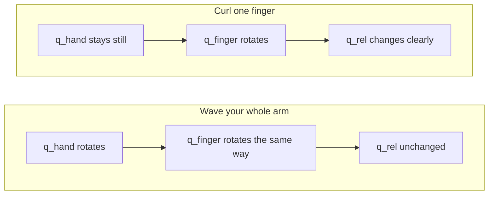

# 06 - Relative Orientation

**Phase 6.**

This is the step that makes the whole idea actually work as a wearable device instead of a bench experiment. Up to this point, every quaternion I've computed is a sensor's orientation in space, which means it changes whether you curl a finger or just wave your whole arm around. That's useless for gesture recognition. I don't care where your hand is pointing. I care what shape your fingers are making.

## The math

```
q_rel = conj(q_hand) ⊗ q_finger
```

`conj(q_hand)` is the hand quaternion's conjugate: negate the x, y, z components, keep w. `⊗` is quaternion multiplication. What this does, in plain terms: it expresses the finger's orientation in the hand's own coordinate frame, instead of in the world's.



Wave your arm around and `q_hand` and `q_finger` rotate together, so `q_rel` doesn't change. Curl a finger and only `q_finger` moves, so `q_rel` changes cleanly. That's the whole point. This one line is what makes the sensor data rotation-invariant.

## Why this matters more than any other single step

If this math is wrong, every labeled training sample built on top of it is wrong, and the classifier trained on those samples will be wrong too, in a way that's hard to diagnose after the fact. It'll just look like "the model doesn't work" with no obvious root cause. This is the last pure signal-processing step before real data collection starts, so it's worth verifying carefully rather than assuming it's correct because the formula looks right on paper.

## The actual test, not just "does it produce numbers"

- Five relative-quaternion streams, one per finger, on serial.
- A 3D skeleton visualizer that mirrors your actual hand pose.
- Rotate your wrist 90° with your fingers held still: the visualizer shouldn't change. Curl a finger: it should change clearly and immediately. That contrast is what actually matters here, not "do the right things change it and the wrong things not."

## What's here

- [`main.cpp`](main.cpp), the relative-orientation implementation.
