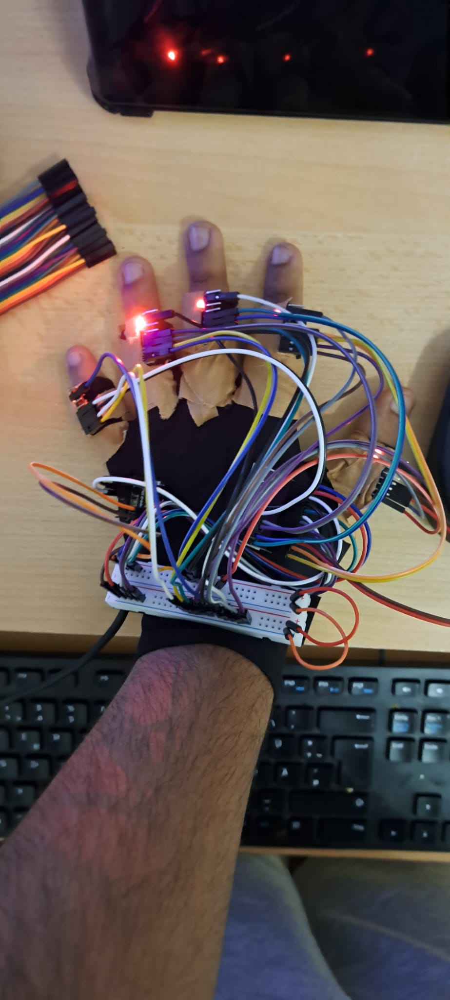
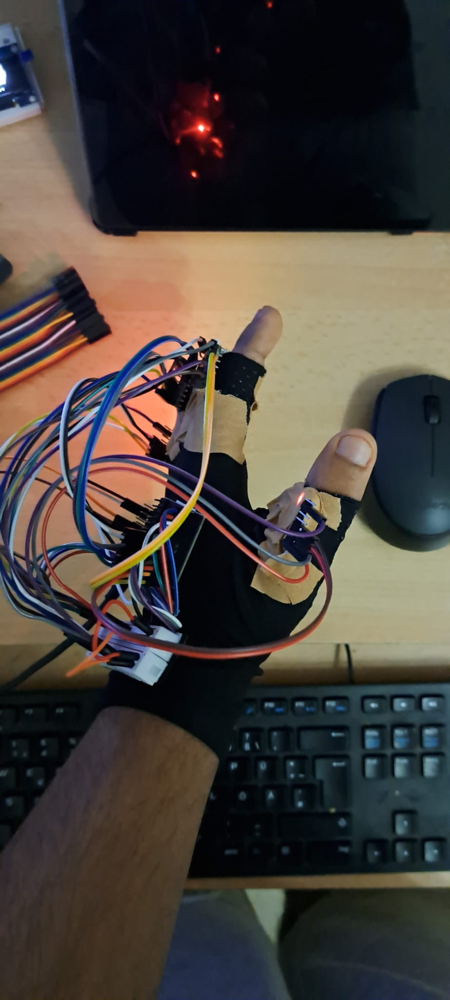
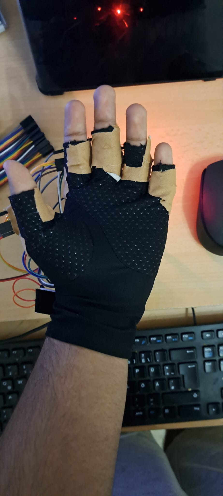
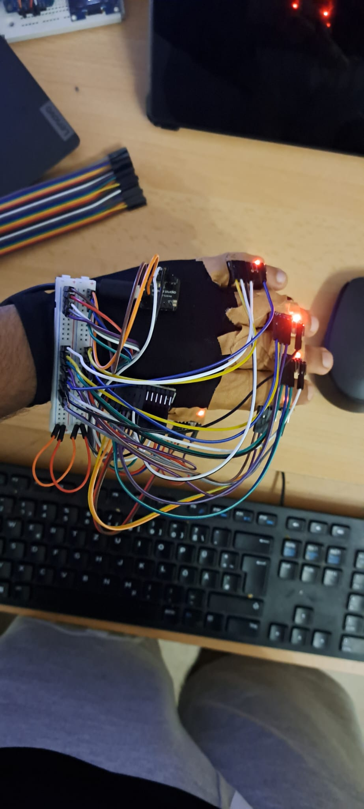

# 07 - Full Glove Assembly

**Phase 7. Status: done.**

Everything up to this point ran on a breadboard. This is where it moves onto the actual glove: all five finger sensors, the mux, and the XIAO physically mounted, wired, and strain-relieved on a real hand.

## What got mounted

All five MPU-6050s taped onto the glove, middle phalanx for index through pinky, proximal phalanx for the thumb, since the thumb's joint geometry is different enough that middle-phalanx placement wouldn't make sense there. The XIAO and the PCA9548A mux, along with a small breadboard used as a wiring hub, got mounted together on the wrist strap. Every finger was wired back to the mux with jumper wire, routed across the back of the hand.

## What passing actually meant

- All five finger sensors readable through a full 30-minute wear session, no disconnects.
- Wire runs anchored so no solder pad ever takes a bend directly. That's the difference between a glove that survives regular use and one that fails at the first knuckle flex.
- The relative-orientation math from the previous stage still tracks correctly while actually wearing the glove, not just sitting flat on a bench.

## How the actual test went

Flashed the raw six-sensor firmware and confirmed all six IMUs powered up and read live, visible both in the serial output and in each finger sensor's own onboard LED lighting up. That closed the electrical half of this stage: the glove-mounted wiring works, not just the bench wiring that came before it.

Then ran the actual acceptance test: thirty continuous minutes of wear, with the glove taken off and put back on multiple times during that window rather than worn continuously. That's a harder test than it sounds. Every removal and re-wear re-flexes each knuckle and re-seats every jumper connection, exactly the kind of repeated mechanical stress that breadboard-quality wiring tends to fail under. It passed. Continuous data the whole time, no connection drops, and the fit stayed comfortable throughout.

## What's still a known weak point

The wire routing from this pass is loose jumper wire, not fully strain-relief-taped at every single knuckle crossing the way the wiring guide specifies: tape anchored on both sides of each flex point, on the wire's insulation rather than the solder pad itself. The 30-minute test surviving without full strain relief is a good sign, but fatigue in stranded wire accumulates over many more sessions than one half-hour test can reveal. This is cheap insurance worth doing properly before the glove sees regular, repeated use.

## The lesson this stage reinforced

Sensor failures on a wearable are almost always wire fatigue at a knuckle, not a bad chip. Stranded wire, not solid-core. Anchored with slack on both sides of a flex point, never a straight run tacked down tight across a joint that's about to bend.

## What's here

- [`main.cpp`](main.cpp), the firmware run for this stage's tests.

