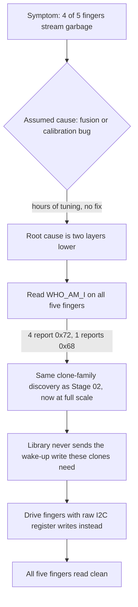
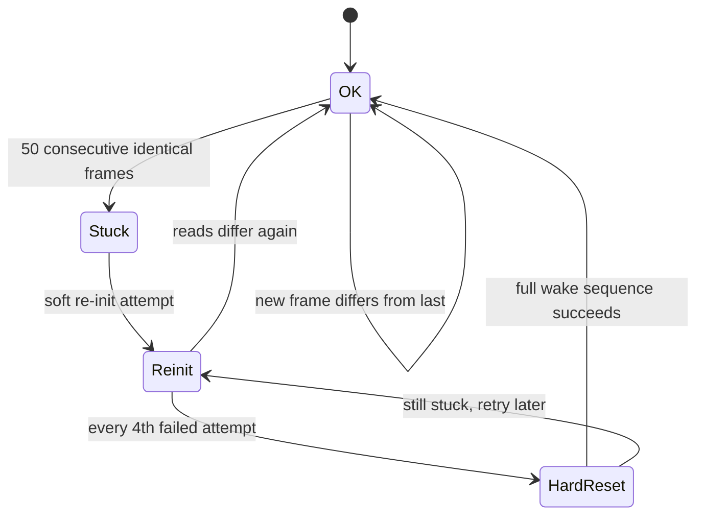

# 08 - BLE Wireless Dashboard

**Phase 7.5, live wireless visualization, ahead of real data collection.**

Once the glove was wired and mounted, I wanted a way to actually see it working, untethered, in real time, in a browser, before committing to the effort of collecting a labeled training set. This stage streams all six IMUs over Bluetooth LE to a live dashboard that renders a 3D hand model plus per-sensor accel/gyro traces. It's also where the hardest debugging session of the whole project happened.

**Firmware:** [`08_ble_dashboard.ino`](08_ble_dashboard.ino), flash it with the Arduino IDE onto the XIAO, using the Adafruit nRF52 board package.
**Dashboard:** `handrig_dashboard.html`, open it directly in Chrome or Edge, desktop or Android, no build step, no server. Canonical copy lives in the project's `tools/` folder; a copy sits [here](handrig_dashboard.html) too, as this stage's actual deliverable.

## Why this is v4, not v1

The first two firmware attempts fed all six IMUs through the same library I'd used since Phase 2, and got garbage back from four of the five fingers. Not noise, actual stuck values. One gyro axis pinned at exactly `246.0938` on every single frame. Another axis ramping by an exact, constant step every frame, like a counter, not like a physical rotation. Real evidence of this is saved in this folder's CSV captures.

I chased this as a fusion or calibration bug for a while, "garbage in, garbage out no matter how I calibrate," and that was the wrong layer to be looking at. The actual problem was two layers below any math: the sensors themselves were never fully waking up.



**Root cause:** the five finger modules are MPU-6500/9250-family clones, same discovery as Phase 2, just five sensors deep into the build before it mattered this much. The library I'd been using talks to them fine at the bus level, I²C acknowledges, addresses respond, but it never sends the specific register write that fully wakes this chip family. So the clones boot into a half-asleep state and return a fixed internal pattern instead of live sensor data. One finger, the pinky, happened to be a genuine MPU-6050 and worked from the start. That "always the same four broken, always the same one working" pattern was the actual clue that pointed at initialization, not wiring or a bad batch.

**The fix:** drop the library for the fingers and drive them with raw I²C register writes: explicit reset, wake, enable-all-axes, configure. That last step, enabling all six accel and gyro axes explicitly, is the one the clones specifically need and the library was silently skipping.

## What changed between v3 and v4

v3 fixed the wake sequence but still assumed every write actually landed. v4 closes that assumption, one gap at a time:

- **Every I²C write's acknowledgment is now checked.** Previously a failed write, including a failed mux channel select, passed silently. A NACKed mux select is a specific kind of dangerous, since it means one finger's configuration can get written to whichever channel was still latched from before.
- **Config gets read back and compared after every init.** An acknowledgment only proves something on the bus answered. It doesn't prove that specific chip actually stored what you sent it. A matching readback does. This is what makes "the sensor initialized successfully" something you can actually trust instead of hope.
- **A runtime "stuck" watchdog runs continuously, not just at boot.** The earlier boot-only check couldn't catch a sensor that froze ten minutes into a session. Now, all six raw values are compared frame to frame, and 50 consecutive bit-identical frames, about one second, means the sensor is frozen. The reasoning behind that threshold isn't a guess: at this sensor's resolution, one unit of precision represents about 122 micro-g, while the chip's own noise floor is several milli-g. A working sensor physically cannot repeat exactly, even sitting motionless on a table. This test is meaningfully stronger than just checking "is the reading close to 1 g," the original stuck thumb passed that weaker check just fine, which is exactly why it went unnoticed for a while.
- **The bus can now recover from a wedge.** If a sensor holds its data line low mid-transaction, the entire bus locks up and every sensor starts reading garbage at once, which looks like total hardware failure but is actually a twenty-line software fix: bit-bang the clock line a few times to force the stuck line free.
- **A cleared "valid" bit now actually means invalid.** Before, a failed read still got sent as zeros with the validity flag left on, meaning a value of exactly zero gravity got fused into the orientation math as though it were real data, a claim that gravity briefly vanished, which is a much worse failure than just dropping the frame.
- **A checksum byte was added to the BLE frame.** The frame's sync byte isn't rare enough to trust on its own, it shows up inside normal sensor payload data often enough that one dropped byte can cause the parser to lock onto the wrong position and render a full screen of plausible-looking garbage.



## Boot diagnostic

Every boot, before BLE advertising starts, the firmware checks all six channels and prints the result to serial at 115200 baud, with the glove held flat and still:

```
#   sid 1 who=0x72  |a|=1.01g  -> OK
#   sid 2 who=0x72  |a|=1.00g  -> STUCK (bit-identical, output registers frozen)
#   sid 3 who=0x72  |a|=0.98g  -> RAMP (constant per-frame delta = digital artifact)
#   sid 4           -> NOT FOUND (no ACK / init or readback failed)
# 5/6 sensors initialised.
```

Read this after every flash before trusting anything downstream of it. If a channel isn't `OK` here, the problem is now electrical, a cold solder joint, wiring, wrong mux channel, not firmware. The init path is verified by readback at this point, so software is no longer a plausible suspect.

## Sensor mounting axis convention

The firmware always streams raw, sensor-frame data. The axis remap into a common frame lives in the dashboard, not the firmware, so every capture stays reinterpretable even if the remap changes later. Measured directly on the mounted glove: for the finger sensors, the sensor's own −Y axis points toward the fingertip and +Z points up. The hand sensor uses a different convention entirely, it's a different chip, mounted differently, which is confirmed by it reading roughly −0.98 g on its Z axis with the glove lying flat, palm down.

## Pre-collection checklist

Before any real labeled-data session, the checklist below has to pass. Bad data collected now becomes an unexplained problem in the classifier much later, far more expensive to catch there than here.

1. Flash the current firmware, hold the glove flat and still, and confirm the boot diagnostic reports all six sensors `OK`.
2. Connect the dashboard, run the calibration routine once, glove flat and still. Every sensor should calibrate clean, no flag raised on any card.
3. Record 60 seconds flat and still, export the CSV, and run it through the noise-baseline check script. It has to print GO. On a NO-GO, fix the flagged sensor's connection and repeat from step 1 rather than pushing ahead anyway.
4. Only once that passes: start real data collection.

## The evidence that cracked it

These two captures are the actual raw data that made the clone-chip diagnosis possible, exported directly from the dashboard before the fix landed.

- [`capture_01_pre_fix_garbage.csv`](capture_01_pre_fix_garbage.csv)
- [`capture_02_pre_fix_garbage_calibrated.csv`](capture_02_pre_fix_garbage_calibrated.csv)
- [`data-notes.md`](data-notes.md), original notes on what these captures show.

## Not there yet

Not the classifier. This stage proves the whole sensing and communication chain works live and wirelessly. The actual gesture recognition model hasn't been trained yet, that's the next real milestone, and it depends on this stage's data quality being trustworthy first.
