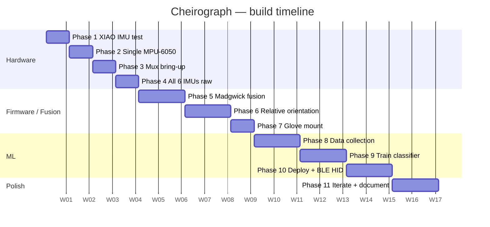

# GENERAL_PLAN.md — Cheirograph

Roadmap, scope, hardware summary, and phase checklist.
This file is mostly static — it records the forward plan, not what actually happened (that's `DOCUMENTATION.md`).

---

## Goal

Build a wearable left-hand gesture-tracking glove that reads finger orientation via six IMUs, fuses it on-device with a Madgwick filter, and classifies the fingerspelling alphabet (static hand-shapes) into text or control signals over BLE HID.

The goal is not only a working glove but a *legible record of the engineering*: every decision documented, every dead-end logged, every layer understood deeply enough to re-explain in a technical interview.

---

## Scope boundary

| In scope | Out of scope |
|---|---|
| Fingerspelling / static hand-shapes (26 letters + custom vocab) | Full ASL translation |
| Left-hand only | Two-hand gestures |
| On-device inference (nRF52840) | Cloud-hosted inference |
| BLE HID keystroke output | Hand location / motion trajectory |

Never re-scope this toward "translate ASL" — it would require location, motion, two hands, and facial expression, none of which an IMU glove captures. Keep targets finishable.

---

## Hardware

| Part | Qty | Role |
|---|---|---|
| Seeed XIAO nRF52840 Sense | 1 | MCU, BLE, onboard LSM6DS3 hand-reference IMU |
| MPU-6050 (GY-521) | 5 | Finger IMUs (all at I²C 0x68, behind mux) |
| PCA9548A I²C mux | 1 | 8-channel mux at 0x70; selects one finger IMU per read |
| Half-finger glove (left) | 1 | Substrate |
| Breadboard + Dupont wires | — | Prototyping |
| Leukoplast tape / cable ties | — | Strain relief |

**Handedness:** all training data is collected on the **left hand**. This is fixed for the dataset — changing it is a breaking change.

---

## Phase checklist

> The firmware folder names below are a **flexible guide**, not a permanent contract.
> Rename, renumber, split, merge, or insert folders as your real progress dictates.
> The fixed principle is: each meaningful milestone gets its own self-contained folder that is never overwritten.

- [x] **Phase 0 — First flash / LED sanity test** (`firmware/00_led_sanity_test/`) ✅ 2026-07-14
  Prove the XIAO powers on, enumerates, and runs code. Deliverable: onboard RGB LED cycling red→green→blue.

- [x] **Phase 1 — XIAO onboard IMU over serial** (`firmware/01_xiao_imu_test/`) ✅ 2026-07-14
  Read the onboard LSM6DS3 via internal I²C; stream raw accel + gyro to serial at 115 200 baud. Deliverable: clean serial trace in contract format (`millis,sensor_id,ax..gz`).

- [x] **Phase 2 — Single MPU-6050, direct I²C** (`firmware/02_single_mpu6050_test/`) ✅ 2026-07-14
  Wire one MPU-6050 directly (no mux); read and stream raw data. Deliverable: second sensor confirmed working in isolation. Raw accel + gyro captured and plotted in 3D (`docs/media/phase2_*_3d.png`).

- [x] **Phase 3 — PCA9548A mux bring-up** (`firmware/03_mux_channel_test/`) ✅ 2026-07-16
  Bring up the mux; address two sensors, then all five. Deliverable: all five MPU-6050s readable by channel-switching the mux. Verified via `scanChannels()` in the Phase 4 sketch — 0x68 on channels 0-4, no cross-talk.

- [ ] **Phase 4 — All 6 IMUs raw at 100 Hz** (`firmware/04_all_imus_raw/`) 🟡 partial 2026-07-16
  Stream all six IMUs (5 MPU-6050 + onboard) at the target loop rate. Requires I²C at **400 kHz** (at the default 100 kHz, five muxed reads ≈ ~10 ms of bus time — the whole budget) and a `millis()`-based fixed-rate scheduler, not `delay()`. Add `tools/plot_raw.py` raw serial plotter. Deliverable: **measured** (from timestamps, not assumed) stable 100 Hz read loop, no missed samples.
  All 5 finger IMUs confirmed reading coherently through the mux (bench data + analysis in `data/phase3-4_five_imu_gyro/`, `tools/analyze_multi_imu.py`). Still open: onboard hand IMU (sensor 0), accelerometer channels, the project's `millis,sensor_id,...` CSV contract (current sketch prints a human-readable line instead), and a `millis()`-scheduled loop at a measured 100 Hz (current loop uses `delay(20)`, ~50 Hz).

- [ ] **Phase 5 — Madgwick fusion per IMU** (`firmware/05_madgwick_fusion/`)
  Per-sensor gyro-bias calibration at startup (log the measured bias values per sensor), then Madgwick on each IMU. Deliverable: orientation holds under slow rotation; **measured drift in °/min before vs. after calibration** recorded in DOCUMENTATION.md.

- [ ] **Phase 6 — Relative orientation + skeleton viz** (`firmware/06_relative_orientation/`)
  Compute `q_rel = conj(q_hand) ⊗ q_finger` for each finger; add `tools/skeleton_viz.py` 3D hand visualiser. Design the "flat hand" re-zero pose here (see DECISIONS.md 2026-07-14 on yaw drift). Deliverable: virtual fingers move correctly; wrist rotation has no effect on relative angles — **and this still holds after 5+ minutes of continuous wear** (pitch/roll must hold; yaw offset handled by the re-zero pose).

- [ ] **Phase 7 — Full glove mount** (`firmware/07_full_glove/`)
  Mount all sensors on the glove with proper strain relief. Deliverable: all sensors survive a 30-minute wear session with no connection drop.

- [ ] **Phase 8 — Labelled data collection** (`data/`)
  Capture labelled samples for each fingerspelling letter; aim for ≥ 30 samples × 3 sessions per class. Deliverable: balanced dataset in `data/`.

- [ ] **Phase 9 — Train classifier (Edge Impulse)** (`ml/`)
  Design DSP block + neural network in Edge Impulse; validate confusion matrix. Deliverable: model with acceptable per-class accuracy exported as Arduino library.

- [ ] **Phase 10 — On-device deploy + BLE HID**
  Deploy model to XIAO; output classified letter as BLE HID keystroke. Deliverable: recognised letter appears in a text field on a paired device.

- [ ] **Phase 11 — Iterate + document**
  Collect more data for confused pairs; refine; write final devlog entries; tag `v1.0`.

---

## Gantt

> Dates are relative weeks from project start (W0). Adjust as reality diverges.

