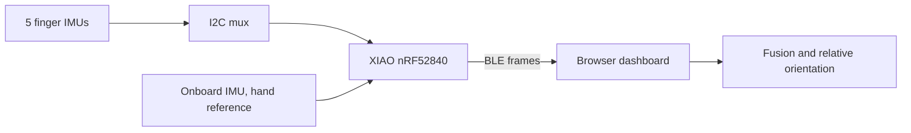

# Cheirograph

*cheir* (χείρ) = hand. *graph* (γράφω) = writing. A glove that reads the shape of your hand.

Cheirograph is a wearable gesture glove for the left hand. Six IMUs track the fingers and the back of the hand. The goal is to recognize static fingerspelling shapes on the device and send the letter out over Bluetooth. I'm building it alone, end to end, and this repo is the code plus an honest log of how it went, including what broke.

## Status

This is what works today and what doesn't. I'd rather say it here than have you find out in the code.

| Layer | Status | Where |
|---|---|---|
| Six IMUs read through an I²C mux | Done, ~94 Hz measured | [Stage 04](04-all-six-imus-raw/) |
| Madgwick fusion on the microcontroller | Done, ~85 Hz measured, bench-tested | [Stage 05](05-madgwick-fusion/) |
| Sensors mounted on a real glove | Done, 30 min wear test | [Stage 07](07-full-glove-assembly/) |
| Wireless stream + live 3D dashboard | Done | [Stage 08](08-ble-wireless-dashboard/) |
| Relative orientation (finger vs. hand) | Works in the dashboard (JS). **Not in the firmware yet.** | [Stage 06](06-relative-orientation/), [`tools/`](tools/) |
| Labelled dataset | Not started. Capture tooling is built. | [`ml/`](ml/) |
| On-device classifier | Not started | [`ml/`](ml/) |
| Bluetooth HID (glove types the letter) | Not started | |

So right now it is a working sensing and visualization system. The recognition part is still ahead.

## Measured results

| What | Result | Source |
|---|---|---|
| Loop rate, 6 IMUs raw | ~94 Hz (target 100) | [Stage 04](04-all-six-imus-raw/) |
| Loop rate with Madgwick on 6 IMUs | ~85 Hz | [Stage 05](05-madgwick-fusion/) |
| Roll/pitch drift, hand held still, ~30 s | under 1.7°/min | [Stage 05](05-madgwick-fusion/) |
| Yaw drift, hand held still | 0.2 to 2.1°/min, expected without a magnetometer | [Stage 05](05-madgwick-fusion/) |
| Wear test | 30 min, glove taken off and on, no dropped connection | [Stage 07](07-full-glove-assembly/) |
| Stuck-sensor detection | 50 identical frames (~1 s) triggers a flag | [Stage 08](08-ble-wireless-dashboard/) |

Things I have **not** measured yet: end-to-end Bluetooth latency, real throughput after the connection fix, drift over several minutes, and any classifier accuracy. Those are on the list.

## How it works



The finger IMUs are all MPU-6050 modules with the same I²C address. The PCA9548A mux lets the board talk to one at a time. The board's own IMU sits flat on the back of the hand and acts as the reference.

The idea that the whole project rests on: a finger's pose should be its orientation relative to the hand, not relative to the room.

```
q_rel = conjugate(q_hand) ⊗ q_finger
```

If you wave your arm, both quaternions rotate together and `q_rel` stays the same. If you curl a finger, only `q_finger` moves. That's what makes the signal usable for classification. Details in [Stage 06](06-relative-orientation/).

**Scope.** Fingerspelling and a fixed set of static hand shapes. Not sign language. Real signing also needs hand position, motion, two hands and facial expression, and six IMUs on one hand can't capture that.

## The build, stage by stage

Every folder is one milestone. It has the code, the raw data and photos, and a write-up. I don't delete old stages, so the history stays readable.

| Stage | What it proves |
|---|---|
| [00 LED sanity test](00-led-sanity-test/) | The board flashes and runs code |
| [01 XIAO onboard IMU](01-xiao-onboard-imu/) | The hand-reference sensor reads clean |
| [02 Single MPU-6050](02-single-mpu6050/) | One finger sensor works, and the sensors turn out to be clones |
| [03 I²C multiplexer](03-i2c-multiplexer/) | Five same-address sensors share one bus |
| [04 All six IMUs raw](04-all-six-imus-raw/) | All six read together at close to 100 Hz |
| [05 Madgwick fusion](05-madgwick-fusion/) | Raw motion becomes orientation, per sensor |
| [06 Relative orientation](06-relative-orientation/) | Finger pose relative to the hand (firmware still a stub) |
| [07 Full glove assembly](07-full-glove-assembly/) | It survives being worn |
| [08 BLE wireless dashboard](08-ble-wireless-dashboard/) | Live wireless stream, and the hardest bug so far |

## The two hardest bugs

**The sensors weren't what they said they were.** The "MPU-6050" modules are clones. Their `WHO_AM_I` register returns `0x72`, not `0x68`. They answer on the bus, so wiring checks pass, but a library that only knows the real chip leaves them half asleep and stuck on one value. I found it by reading the identity register directly. Later it came back at full scale: four of five finger sensors sent bit-identical values while looking plausible (about 1 g). A working sensor always jitters by around 20 LSB, so identical values for 50 frames means the output is frozen. The firmware now checks for that all the time. Evidence is in [Stage 02](02-single-mpu6050/) and [Stage 08](08-ble-wireless-dashboard/).

**A Bluetooth problem that looked like a sensor problem.** The dashboard connected and then sat at 0 Hz. I added timing around each part of the loop. Sensors and fusion were fine. The BLE write call itself blocked for over 100 ms because the default connection parameters were too conservative for my data rate. Changing them fixed it. The lesson: measure before you guess what is slow.

## Hardware

| Part | Role |
|---|---|
| Seeed XIAO nRF52840 Sense | MCU, hand-reference IMU, Bluetooth |
| 5× MPU-6050 (clones) | One per finger |
| PCA9548A | I²C mux, fixes the address collision |
| Half-finger glove, left hand | Everything mounts to it |

Parts list and wiring: [`hardware/`](hardware/).

## Skills this project uses

- **Embedded C++** with a hard timing budget per loop.
- **I²C at register level.** Reading and writing config registers directly after the library hid a real bug.
- **Sensor fusion.** Quaternions, Madgwick, gyro-bias calibration, and careful coordinate frames.
- **Hardware debugging.** Raw register values and CSV evidence instead of guessing.
- **Data visualization.** Live 3D hand in the browser over Web Bluetooth, plus Python scripts for analysis.
- **Protocol design.** A compact binary BLE frame with a checksum, added after a real corruption bug.
- **TinyML (planned).** Small classifier running on the MCU.

## Run it

1. Arduino IDE with the Seeed board package ("Seeed nRF52 Boards" in Boards Manager).
2. Select **Seeed XIAO nRF52840 Sense** and its port. If no port shows up, double-tap RESET.
3. Open the `.ino` in a stage folder and upload. Serial Monitor at 115200 baud.
4. For the dashboard, open [`tools/handrig_dashboard.html`](tools/handrig_dashboard.html) in Chrome or Edge.

Python tools: `cd tools && pip install -r requirements.txt`. Board info: [`hardware/datasheets/`](hardware/datasheets/).

## Contributing and license

Questions and ideas are welcome, see [`CONTRIBUTING.md`](CONTRIBUTING.md). MIT license, see [`LICENSE`](LICENSE).
