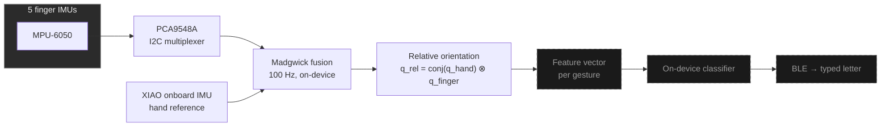
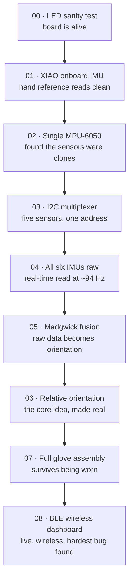

# Cheirograph

*cheir* (χείρ), hand. *graph* (γράφω), writing. A glove that reads your hand's shape and turns it into text.

Cheirograph is a wearable gesture-tracking glove I'm building solo, end to end: six motion sensors, real-time sensor fusion running on a microcontroller, and eventually an on-device machine learning model that recognizes fingerspelling. This repo is both the code and an honest record of how it got built, including the parts that broke on the first try.

## What it actually does

The glove has six IMUs (accelerometer and gyroscope chips): one on each of five fingers, plus one on the back of the hand as a reference. Each sensor's raw motion data gets fused into an orientation using a Madgwick filter, running at 100 Hz on the microcontroller itself, not offloaded to a laptop. Every finger's orientation is then expressed relative to the hand, so waving your arm around changes nothing, but curling a finger changes the signal cleanly. That relative-orientation data is what a classifier will eventually read to recognize static hand shapes and output them as text over Bluetooth.

Scope, deliberately: fingerspelling and a fixed set of static hand shapes. Not full sign language. Real signing also involves hand location relative to the body, motion trajectories, two hands working together, and facial expression, none of which six IMUs on one hand can capture. An achievable target mattered more to me than an impressive-sounding one I couldn't actually finish.

## Why this project

I wanted one project where I genuinely understood every layer, from the electrical signal to the final output, instead of gluing together libraries I didn't fully trust. That meant hitting real hardware bugs and root-causing them properly instead of working around them. It happened more than once, and each time taught me more than a version of this project where everything just worked would have.

## How it's built

Dashed boxes are the next milestones, not built yet.

## The build, stage by stage

Each folder below is a self-contained milestone: the actual firmware or code for that stage, the raw data and photos that prove it worked, and a write-up of what happened, including what broke. They build on each other in order. I didn't skip a layer before proving the one under it.

| Stage | What it proves |
|---|---|
| [00 · LED Sanity Test](00-led-sanity-test/) | The board flashes and runs code at all |
| [01 · XIAO Onboard IMU](01-xiao-onboard-imu/) | The hand-reference sensor reads clean |
| [02 · Single MPU-6050](02-single-mpu6050/) | One finger sensor works, and where I found the sensors were mislabeled clones |
| [03 · I²C Multiplexer](03-i2c-multiplexer/) | Five identical-address sensors can be told apart on one bus |
| [04 · All Six IMUs Raw](04-all-six-imus-raw/) | All six sensors read together at close to 100 Hz |
| [05 · Madgwick Fusion](05-madgwick-fusion/) | Raw motion data becomes real orientation, per sensor |
| [06 · Relative Orientation](06-relative-orientation/) | Finger orientation gets expressed relative to the hand, the core idea of the whole project |
| [07 · Full Glove Assembly](07-full-glove-assembly/) | Everything survives being mounted on an actual hand and worn |
| [08 · BLE Wireless Dashboard](08-ble-wireless-dashboard/) | The whole chain works live, wirelessly, and where the hardest bug of the project got found and fixed |

## The two hardest problems I actually solved

**The sensors weren't what they claimed to be.** Every "MPU-6050" module I bought is actually a clone from a related chip family. It responds fine on the I²C bus, so wiring checks pass. But a library that only knows the real chip's wake-up sequence leaves it half-asleep, returning a fixed, stuck value instead of live data. I diagnosed this by reading the chip's identity register directly instead of trusting a library's judgment, then hit it again months later at full scale: four of five finger sensors streaming bit-identical "stuck" values while looking otherwise plausible. The full story, with the actual raw CSV evidence, is in [Stage 02](02-single-mpu6050/) and [Stage 08](08-ble-wireless-dashboard/).

**A wireless link dying under load looked like a sensor problem. It wasn't.** The dashboard would connect and then sit stuck at 0 Hz. Adding real instrumentation, logging exactly how long each part of the loop took, showed the sensors and fusion math were fine. The Bluetooth write call itself was blocking for over 100 milliseconds because the radio link's default bandwidth settings were too conservative for the data rate I needed. Widening the connection parameters fixed it completely. Lesson that stuck: measure before you guess which part of the system is actually slow.

## Hardware

| Part | Role |
|---|---|
| Seeed XIAO nRF52840 Sense | Microcontroller, hand-reference IMU, Bluetooth |
| 5× MPU-6050 (clone) | One per finger |
| PCA9548A | 8-channel I²C multiplexer, resolves the address collision from five identical sensors |
| Half-finger glove, left hand | The physical substrate everything mounts to |

Full parts list and wiring map: [`hardware/`](hardware/).

## What this project actually exercises

- **Embedded C/C++** on a real microcontroller. A timed sensor-read loop that has to hit a hard rate budget, not just "run eventually."
- **I²C at the register level.** Not just calling a library, but reading and writing specific control registers directly once the library abstraction turned out to be hiding a real bug.
- **Sensor fusion.** Quaternion-based orientation from raw accelerometer and gyroscope data, gyro-bias calibration, and careful reasoning about coordinate frames instead of assuming they match.
- **Systematic hardware debugging.** Reading raw register values and CSV exports instead of guessing, on two separate real bugs that both looked like something else at first.
- **Live data visualization.** A 3D hand model rendered in-browser from a live Bluetooth stream, plus a handful of Python scripts for plotting and analyzing captured sensor data.
- **Wireless protocol design.** A compact custom binary frame format over Bluetooth LE, including a checksum added after a real bug taught me why I needed one.
- (Coming) **TinyML.** Training a small classifier and deploying it to run directly on the microcontroller, no cloud round-trip.

## A curated copy of everything, sorted by type

If you want the raw material, every firmware file, every dataset, every image, without reading through nine stage folders, [`Data/`](Data/) has it all pulled together and sorted by type instead of by stage: firmware, CSVs, images, HTML, datasheets.

## Getting it running

1. Arduino IDE, with the Seeed board package added (`File → Preferences → Additional Boards Manager URLs`, then install "Seeed nRF52 Boards" via Boards Manager).
2. Select **Seeed XIAO nRF52840 Sense** as the board, and its COM port (double-tap RESET if the port doesn't show up, a known nRF52840 quirk, not a broken board).
3. Open the `.ino` in any stage folder above and upload it.
4. Serial Monitor at 115200 baud.

Board reference and pinouts: [`hardware/datasheets/`](hardware/datasheets/).

## License

MIT. See [`LICENSE`](LICENSE).
