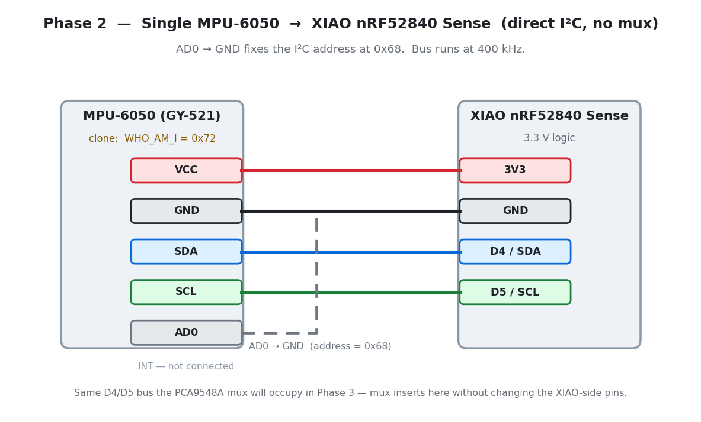
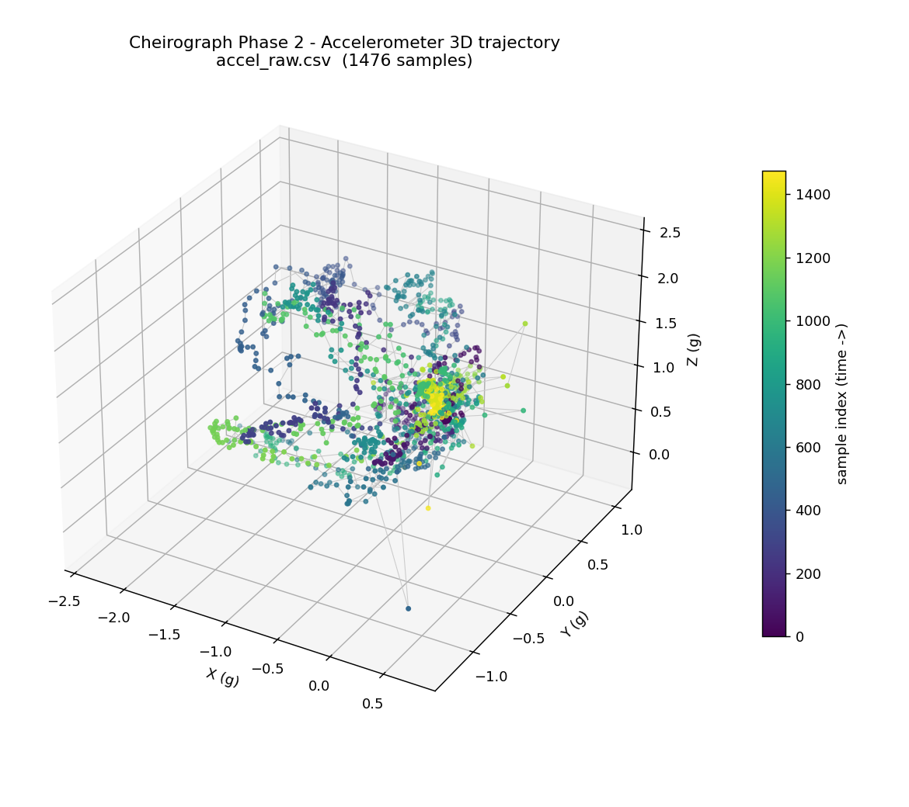
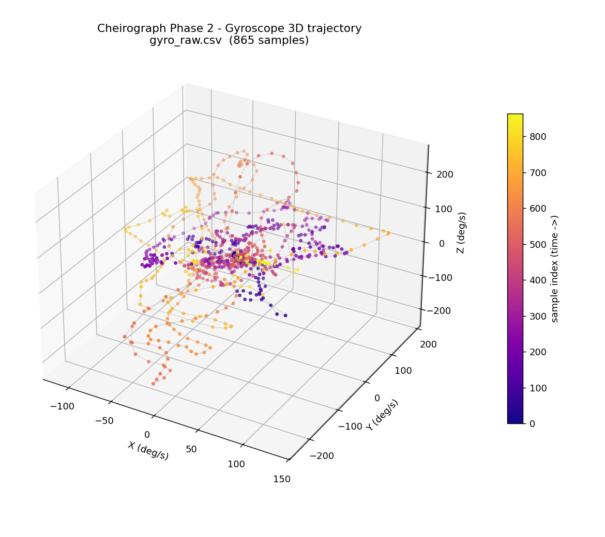

# 02 — Single MPU-6050 Test (Direct I²C)

> *This folder's number is a flexible guide, not a permanent label. Rename or renumber as the real build dictates.*

**Phase:** 2
**Status:** ✅ sensor alive, raw accel + gyro verified and plotted. Mux not yet involved.

**Goal:** Wire one MPU-6050 (GY-521) directly to the XIAO's external I²C pins — no mux — and confirm raw accel + gyro readings over serial.

---

## Wiring (direct, no mux)

Four wires. AD0 → GND fixes the address at `0x68`.



```
        MPU-6050 (GY-521)                 XIAO nRF52840 Sense
        ┌──────────────┐                  ┌──────────────────┐
        │ VCC ─────────┼──────────────────┤ 3V3              │
        │ GND ─────────┼──────────────────┤ GND              │
        │ SDA ─────────┼──────────────────┤ D4 / SDA         │
        │ SCL ─────────┼──────────────────┤ D5 / SCL         │
        │ AD0 ─────────┼───┐              │                  │
        │ INT   (n/c)  │   └── GND ────────┤ GND  (→ 0x68)    │
        └──────────────┘                  └──────────────────┘
```

| MPU-6050 pin | XIAO pin | Purpose |
|---|---|---|
| VCC | 3V3 | Power (3.3 V logic — no level shifter needed) |
| GND | GND | Ground |
| SDA | D4 / SDA | I²C data |
| SCL | D5 / SCL | I²C clock |
| AD0 | GND | Selects I²C address `0x68` |
| INT | — | Interrupt, unused here |

> This is the same D4/D5 bus the PCA9548A mux will sit on in Phase 3. Proving one
> bare sensor here first means that if a finger misbehaves after the mux goes in,
> we already know the sensor and driver are good — so the mux is the suspect.

---

## Sketches in this folder

| File | Output | Role |
|---|---|---|
| `02_single_mpu6050_test.ino` | `millis,sensor_id,aX,aY,aZ,gX,gY,gZ` | **Milestone** — full serial contract, the reusable one |
| `diagnostics/i2c_scan/i2c_scan.ino` | text | Scans the bus + reads `WHO_AM_I` — the sketch that found the clone |
| `diagnostics/gyro_raw/gyro_raw.ino` | `gX,gY,gZ` | Minimal gyro-only stream (used for the 3D plot) |
| `diagnostics/accel_raw/accel_raw.ino` | `aX,aY,aZ` | Minimal accel-only stream (used for the 3D plot) |

Arduino IDE compiles exactly one sketch per folder, so each diagnostic lives in
its own subfolder. Open the `.ino` and the folder name will match.

**Library:** `MPU6050_light` **v1.2.1** by rfetick (Library Manager → search "MPU6050_light").
Why this one and not Adafruit_MPU6050 → see `DECISIONS.md` (2026-07-14).

**Board package:** Seeed nRF52 mbed-enabled boards — *record exact version here at next flash.*

---

## The clone — why the first library failed

The first attempt used `Adafruit_MPU6050` and it just printed
`Failed to find MPU6050 chip!` and halted. The bring-up went:

1. **I²C scan** (`diagnostics/i2c_scan/`) → device present at **`0x68`**. Wiring is fine.
2. **`WHO_AM_I` (register 0x75)** → returns **`0x72`**, not the `0x68` a genuine
   MPU-6050 reports. This module is a **clone** (the 0x72 ID belongs to the
   MPU-6500 / 9250 family that fills a lot of cheap "MPU-6050" breakouts).
3. Adafruit validates `WHO_AM_I` strictly and refuses the mismatch; `MPU6050_light`
   doesn't, so it drives the clone without complaint.

Full write-up in `DECISIONS.md` (2026-07-14); sources in `docs/REFERENCES.md`.
**Watch-item:** a clone can differ in register defaults / self-test, so if fusion
misbehaves in Phase 5 this is a suspect. All five finger modules are likely the
same clone — scan each one when it goes on.

---

## "Done" looks like

- [x] Sensor responds at `0x68`; readings stream without I²C hangs or `0xFF` garbage.
- [x] Accelerometer: a flat, still sensor reads ≈ `0, 0, 1` g (gravity on Z). Tilting swings the axes predictably.
- [x] Gyroscope: ≈ `0` deg/s at rest (after `calcOffsets()`), swings to ±100–240 deg/s on fast twists and returns to ~0.
- [x] Captures saved (`data/phase2_single_mpu6050/`) and plotted in 3D (`docs/media/phase2_*_3d.png`).

**What this is not:** No mux, no fusion, no other sensors. Just one honest sensor.

---

## The 3D plots

Generated with `tools/plot_imu_3d.py` from the two diagnostic captures. Each point
is one sample; colour runs dark→bright with time so you can read the *order* of
motion, not just the point cloud.



The accelerometer path is the clean sanity check: because gravity has a constant
magnitude, every point sits roughly on a sphere of radius ~1 g. Slow hand
rotation walks the gravity vector around that sphere; the bright cluster is where
the sensor was set down still at the end (≈ `0, -0.1, 1.2` g). The few spikes
past 2 g are real linear acceleration from quick shakes, not noise.



The gyroscope path loops far out from the origin during each twist and returns
toward zero when the motion stops — angular *rate*, not angle. That return-to-zero
is what lets `calcOffsets()` measure and subtract the resting bias. Note it never
returns to a perfect zero: the small leftover (~2–3 deg/s) is exactly the drift
source the Madgwick filter will have to fight in Phase 5.

---

## Next

Introduce the PCA9548A mux (`firmware/03_mux_channel_test/`): address `0x70`,
select a channel, then talk to the same `0x68` sensor *through* it. Run the
WIRING.md pre-flight checks (pull-ups, 400 kHz) before wiring the glove.
