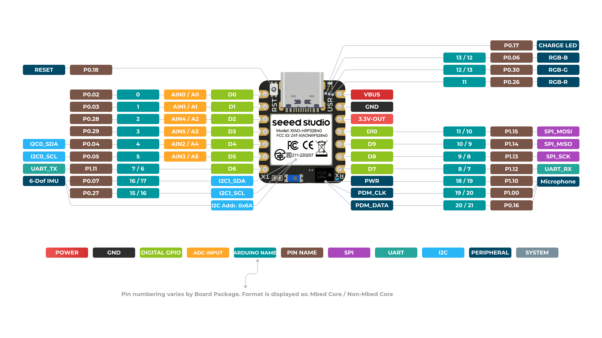
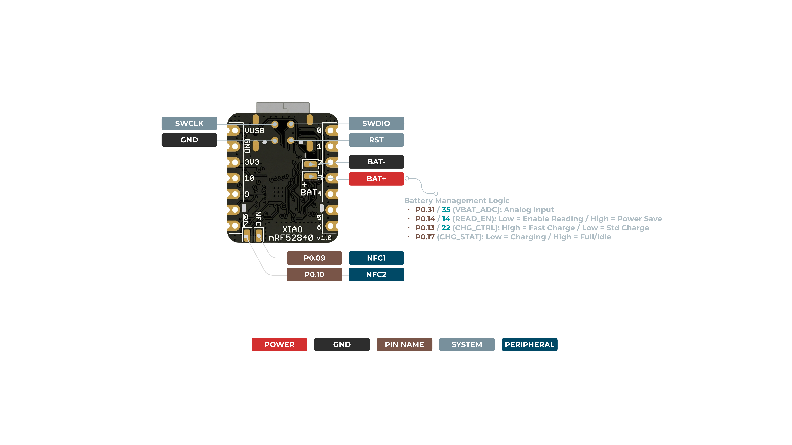

# Seeed Studio XIAO nRF52840 Sense — Reference

The MCU at the heart of Cheirograph: the microcontroller, the BLE radio, **and** the
back-of-hand reference IMU, all on one 21 × 17.8 mm board.

Official wiki: <https://wiki.seeedstudio.com/XIAO_BLE/>

---

## Why this board for Cheirograph

- **Onboard 6-DOF IMU (LSM6DS3TR-C)** on the *internal* I²C bus → doubles as the
  hand-reference sensor, so we don't need a sixth external module. It is **not** behind
  the PCA9548A mux.
- **Bluetooth Low Energy 5.x + onboard antenna** → the eventual BLE-HID "type the letter" path.
- **ARM Cortex-M4F @ 64 MHz** → enough headroom for Madgwick fusion ×6 and a small
  TinyML classifier on-device.
- **Tiny + single-sided** → wearable form factor, sits flat on the back of the hand.

---

## Key specs

| Item | Value |
|---|---|
| Processor | Nordic nRF52840, ARM Cortex-M4 32-bit w/ FPU, 64 MHz |
| Wireless | Bluetooth Low Energy 5.x / BLE Mesh / NFC |
| Memory | 256 KB RAM, 1 MB internal flash + **2 MB onboard flash** |
| Built-in sensors | 6-DOF IMU (**LSM6DS3TR-C**), PDM microphone (Sense only) |
| Interfaces | 1×UART, 1×I²C, 1×SPI, 1×NFC, 1×SWD, 11×GPIO(PWM), 6×ADC |
| Power (standby) | < 5 µA |
| Battery | Onboard BQ25101 Li-ion charge/discharge management |
| Buttons / LEDs | RESET button; 3-in-one RGB user LED + charge LED |
| Logic level | **3.3 V** (do not use 5 V pull-ups on the I²C bus) |
| Size | 21 × 17.8 mm |
| Languages | Arduino / MicroPython / CircuitPython |

---

## Pinout

**Front:**

**Back:**

### Pin map

| XIAO Pin | Function | Chip Pin | Description | Arduino Name |
|---|---|---|---|---|
| 5V | VBUS | — | Power Input/Output | — |
| GND | — | — | — | — |
| 3V3 | 3V3_OUT | — | Power Output | — |
| D0 | Analog | P0.02 | GPIO, AIN0 | 0 |
| D1 | Analog | P0.03 | GPIO, AIN1 | 1 |
| D2 | Analog | P0.28 | GPIO, AIN4 | 2 |
| D3 | Analog | P0.29 | GPIO, AIN5 | 3 |
| **D4** | **Analog, SDA** | **P0.04** | **GPIO, I²C Data, AIN2** | **4** |
| **D5** | **Analog, SCL** | **P0.05** | **GPIO, I²C Clock, AIN3** | **5** |
| D6 | TX | P1.11 | GPIO, UART Transmit | 7/6 |
| D7 | RX | P1.12 | GPIO, UART Receive | 8/7 |
| D8 | SPI_SCK | P1.13 | GPIO, SPI Clock | 9/8 |
| D9 | SPI_MISO | P1.14 | GPIO, SPI Data | 10/9 |
| D10 | SPI_MOSI | P1.15 | GPIO, SPI Data | 11/10 |
| NFC1 | — | P0.09 | NFC | — |
| NFC2 | — | P0.10 | NFC | — |
| Reset | — | P0.18 | RESET | — |
| ADC_BAT | READ_BAT_ENABLE | P0.14 | Enable for battery voltage reading | — |
| 6-DOF IMU_PWR | — | P1.08 | Power switch of the 6-DOF module | — |
| 6-DOF IMU_INT1 | — | P0.11 | Interrupt pin of the 6-DOF module | — |
| PDM Mic DATA | — | P0.16 | PDM audio data input | — |
| PDM Mic CLK | — | P1.00 | PDM audio clock output | — |
| RF Switch Select | — | P2.05 | Switch onboard antenna | — |
| RF Switch Power | — | P2.03 | Power | — |
| CHARGE_LED | — | P0.17 | Charge LED (red) | — |
| USER_LED_R | — | P0.26 | User RGB LED, red | 11 |
| USER_LED_B | — | P0.06 | User RGB LED, blue | 13/12 |
| USER_LED_G | — | P0.30 | User RGB LED, green | 12/13 |

> **For Cheirograph:** the external MPU-6050 finger sensors + PCA9548A mux share the
> **D4 (SDA) / D5 (SCL)** I²C bus. The onboard IMU lives on a *separate internal* I²C
> bus and does not consume D4/D5.

---

## The two Seeed Arduino libraries — which to install

Seeed ships **two** board packages. They overlap for basic use (LED, digital, analog,
serial, I²C, SPI), but differ for the advanced features:

| Package | Install it when you want… |
|---|---|
| **Seeed nRF52 Boards** | Bluetooth / BLE and the low-energy features. |
| **Seeed nRF52 mbed-enabled Boards** | Embedded Machine Learning, or the advanced **IMU & PDM** functions. |

You can install **both** and switch per sketch. For Cheirograph we'll ultimately need
the BLE path *and* on-device ML, so having both available is expected.

### Board setup (Arduino IDE)

1. **File → Preferences → Additional Boards Manager URLs:**
   `https://files.seeedstudio.com/arduino/package_seeeduino_boards_index.json`
2. **Tools → Board → Boards Manager**, search `seeed nrf52`, install the version(s) you need.
3. **Tools → Board →** *Seeed XIAO nRF52840 Sense*.
4. **Tools → Port →** the port labelled *Seeed Studio XIAO nRF52840 Sense*.

### Connection gotcha

If the board doesn't enumerate as a flashable port, **double-tap the RESET button** to
force UF2 bootloader mode, then re-select the port.

---

## Related firmware

- [`firmware/00_led_sanity_test/`](../../firmware/00_led_sanity_test/) — first-light LED blink.
- [`firmware/01_xiao_imu_test/`](../../firmware/01_xiao_imu_test/) — read the onboard IMU
  (LSM6DS3, I²C addr `0x6A`) via [Seeed_Arduino_LSM6DS3](https://github.com/Seeed-Studio/Seeed_Arduino_LSM6DS3).
